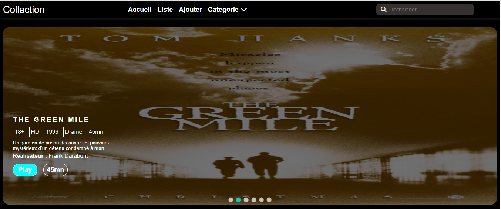
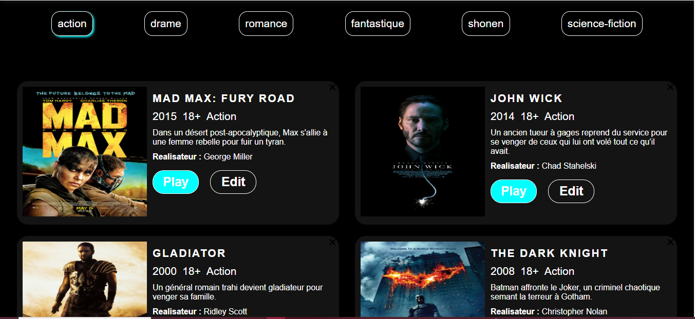
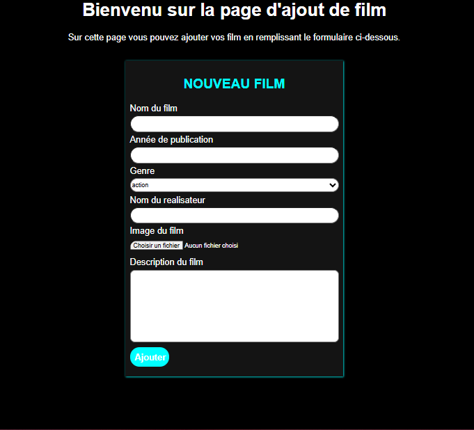

# Creation d'une application de gestion des films


## 📖 Description

Le projet vise à créer une application qui permettra aux utilisateurs de gérer une base de données de films.


## 🚀 Fonctionnalités

- Affichage des films  
- Ajout de films
- Recherche et filtrage
- Modification et suppression

## 🚀 Ulistration
 ,(assets/images/website/home2.png)
 
 

## 🛠️ Installation


### Installation

1. Cloner le dépôt :

   ```bash
   git clone https://github.com/zenon12/gestion_films.git
   cd gestion_films
   ```
2. Accéder à l'application :
   - Application : http://localhost:8080

## 🧑‍💻 Utilisation
  - Cliquez sur 'List'(au niveau de la navbar) pour afficher la liste des films
  - Cliquez sur 'Ajout'(au niveau de la navbar) pour ajouter un  film
  - Cliquez sur 'Category'(au niveau de la navbar) pour afficher la liste des categories


## 🗂️ Structure du projet

```
gestion_films/
├── API/
│   ├──data.json
├── assets/
│   ├──css /
│   ├── js/
│   ├── image/
├── README.md
├── addMovie.html
├── list.html
└── index.html
```


## 🤝 Contribution

1. Forker le projet
2. Créer une branche (`git checkout -b feature/AmazingFeature`)
3. Committer vos changements (`git commit -m 'Add some AmazingFeature'`)
4. Pousser la branche (`git push origin feature/AmazingFeature`)
5. Ouvrir une Pull Request

## 📄 Licence

Ce projet est sous licence MIT - voir le fichier [LICENSE](LICENSE) pour plus de détails.

## 🙏 Remerciements


- VS code pour l'environnement de développement
- Chrome pour l'affichage des pages 

## 📧 Contact

Pour toute question ou suggestion, contactez :

- [mamadousaliouba588@gmail.com](mailto:mamadousaliouba588@gmail.com)
- [@votre-x](https://x.com/@xenon0567)
